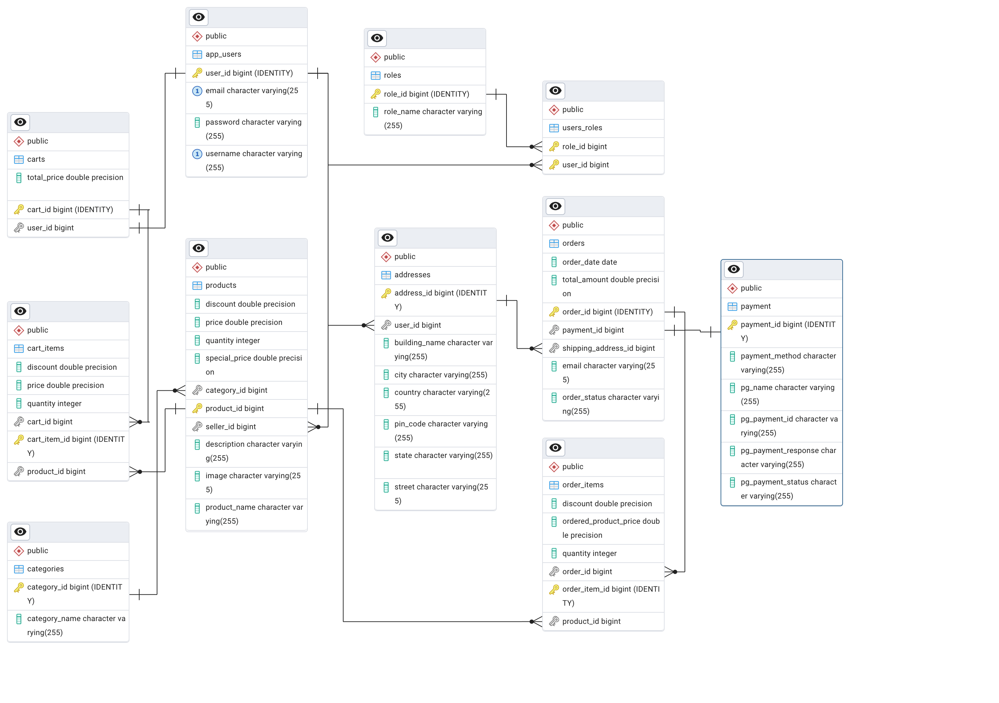

# 🛒 Spring Boot E-Commerce Backend

## 📌 Overview
This is a production-grade backend for an e-commerce application built using **Spring Boot 3**. It manages essential features like product catalogs, cart functionality, and order processing with a modern architecture.

Key technologies integrated:
- ✅ **Spring Boot** for rapid development
- ✅ **JPA (Hibernate)** for database ORM
- ✅ **MySQL/PostgreSQL** for persistence
- ✅ **Swagger UI** for API documentation and testing
- ✅ **Stripe-ready payment architecture** — server generates payment intent, while **client finalizes payment** securely

> 🔗 **Inspired by:** [EmbarkX Spring Boot Course - sb-ecom](https://github.com/EmbarkXOfficial/spring-boot-course/tree/main/sb-ecom)

**Schema**

---

## 📚 Table of Contents
1. [Getting Started](#getting-started)
2. [API Documentation](#api-documentation)
3. [Main Features](#main-features)
4. [Project Structure](#project-structure)
5. [Limitations](#limitations)
6. [Future Improvements](#future-improvements)

---

## 🚀 Getting Started

### ✅ Prerequisites:
- Java 17+
- Maven
- MySQL or PostgreSQL running locally or via Docker

### 📦 Run Locally
```bash
mvn spring-boot:run
```

Or package it:
```bash
mvn clean install
java -jar target/spring-ecom.jar
```

---

## 🔍 API Documentation

Test all REST endpoints directly:
- Swagger UI: [http://localhost:8080/swagger-ui.html](http://localhost:8080/swagger-ui.html)
- OpenAPI Spec: [http://localhost:8080/v3/api-docs](http://localhost:8080/v3/api-docs)

---

## ✨ Main Features

- ✅ **Product Module**
  - Create, read, update, delete (CRUD)
  - Category linkage & image uploads

- ✅ **Cart Module**
  - Add/update/delete items
  - Automatically adjusts when products are updated or removed

- ✅ **Order Module**
  - Place order from user cart
  - OrderItems, payment info, and inventory updates

- ✅ **Stripe Payment Integration (Server-Side)**
  - Spring Boot creates Stripe PaymentIntent
  - Returns `client_secret` to frontend
  - **Client completes payment using Stripe Elements**

- ✅ **Address Management**
  - Store and use shipping addresses during checkout

- ✅ **Validation & Error Handling**
  - Input-level validation on DTOs

- ✅ **Swagger Documentation**
  - Built-in Swagger UI with auto-generated OpenAPI docs

---

## 🗂️ Project Structure
```
com.ecommerce.project
├── config            # Swagger, CORS, etc.
├── controller        # REST APIs
├── dto / payload     # Request/response DTOs
├── event             # Domain events (e.g., cart updates on product changes)
├── exception         # Custom exception classes
├── model             # JPA entities
├── repository        # Spring Data JPA interfaces
├── service           # Business logic
├── util              # Helpers/utilities
```

---

## ⚠️ Limitations

- ❌ Stripe payments are **only server-prepared**, frontend must complete payment via client-side Stripe SDK
- ❌ No admin panel or CMS features
- ❌ No email or SMS notifications
- ❌ Testing coverage (unit + integration) is still minimal
- ❌ Centralized error responses using `@RestControllerAdvice`

---

## 🔮 Future Improvements

- 💳 Full Stripe + webhook integration
- 🛎️ Email notifications on successful orders
- 🔐 Add Spring Security + JWT for role-based auth
- 📦 Dockerized backend + docker-compose support
- 🧪 JUnit + MockMvc tests with CI/CD setup

---

> Built with ❤️ using Spring Boot & Stripe